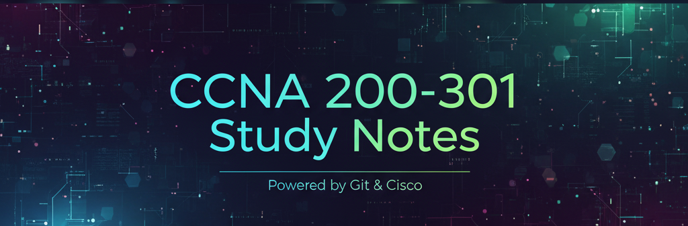

# 📚 CCNA 200-301 Study Notes & Resources

  

        

Welcome! This repository contains my personal notes, summaries, and resources compiled while preparing for the Cisco Certified Network Associate (CCNA 200-301) certification exam. All notes are being created using Obsidian, leveraging its Markdown format and interlinking capabilities to aid in studying. I am also using Packet Tracer as my primary lab environment to test and verify all configurations.

 

## ✅ Prerequisites

To effectively use these notes and run the lab configurations, you will need:

* **Cisco Packet Tracer:** Used to create and test all lab topologies (`.pkt` files).
* **Obsidian:** (Optional) If you want to use the notes with the internal links and graph view, you will need the Obsidian application.
* **Basic Understanding of Networking:** This material assumes prior exposure to fundamental networking concepts (e.g., binaries, IP addresses, basic command-line interface familiarity).

 

## 🧭 Table of Contents

* [🎯 Goal](#-goal)
* [🗺️ Repository Structure](#️-repository-structure)
* [🛠️ How to Use These Notes](#️-how-to-use-these-notes)
* [📝 Key References](#️-key-references)
* [🟢 Project Status](#️-project-status)
* [🤝 Contact](#️-contact)
* [⚖️ License](#️-license)

 

## 🎯 **GOAL**

The purpose of this repository is to:

* Serve as my personal **quick reference** during preparation.

* **Organize study material** into a clear and easily searchable format.

* **Help fellow CCNA** students with notes and practical examples.

 

## 🗺️ **REPOSITORY STRUCTURE**

The notes are organized following the official 200-301 exam topic domains:
...

 

## **🛠️ HOW TO USE**

1. 🔍 **Explore**: Navigate through the folders and .md (Markdown) files to find the specific topic you need to review.
2. ✍️ **Contribute** (Optional): If you find an error or have a clearer way to explain a concept, feel free to open a Pull Request!
3. 🧪 **Labs**: Check the Labs/ section for configuration examples of key Cisco IOS commands (often referencing Packet Tracer files).

 

## 📝 **KEY REFERENCES**

This material is primarily based on:

 * **Official Cisco material.**
 
 * **OCG (Official Certification Guide) textbooks.**

 * **Online training courses (e.g., Jeremy's IT Lab, David Bombal).**

 * **Cisco documentation.**

 

## 🤝 **CONECT**

If you have any questions or want to connect with other students:

  * **GitHub Name:** [@luissanher-g](https://github.com/luissanher-g)

  * **LinkedIn:** [@shluis](https://www.linkedin.com/in/shluis)

Good luck with your CCNA exam! Keep studying hard! 🚀

 

## ⚖️ **LICENSE**

This project is licensed under the **MIT License**. Feel free to copy, modify, and share these notes for personal study, but please reference the original repository.

 

  

